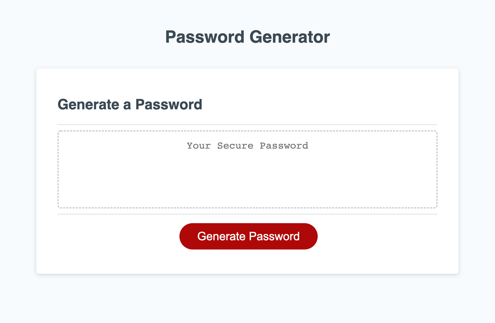

# Challenge-3-Password-Generator

## Website Purpose

An intelligent random password generator that will take user inputs about the
types of characters they wish to include, as well as the desired length of the
password.

## Page Built With

- Semantic HTML 5
- Basic CSS 3
- JavaScript ES6 / ES2015

## Usage

Click the red Generate Password button to begin the password generation function.
Follow the prompts to generate the desired password.

## Website URL

https://anillag.github.io/Challenge-3-Password-Generator/

## Contributors

Made with ❤️ by Joe Gallina (contains starter code from Trilogy Education Services)

### ©️2022 Joe Gallina, Trilogy Education Services
